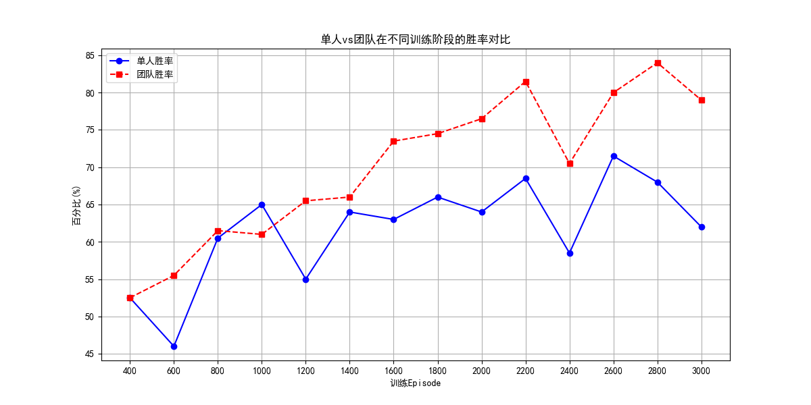
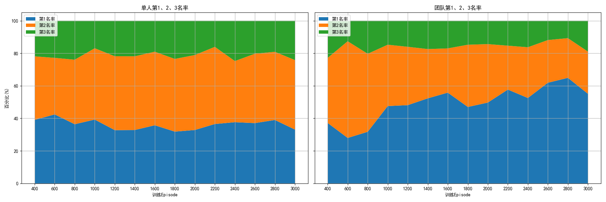
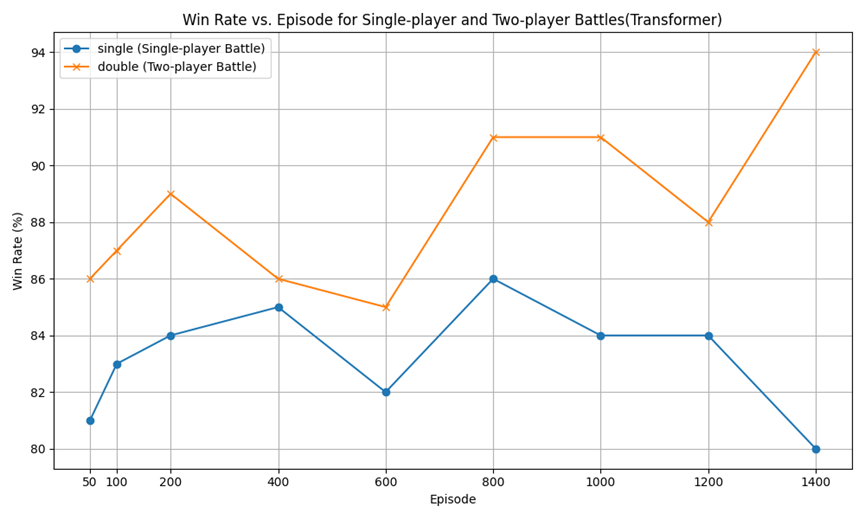
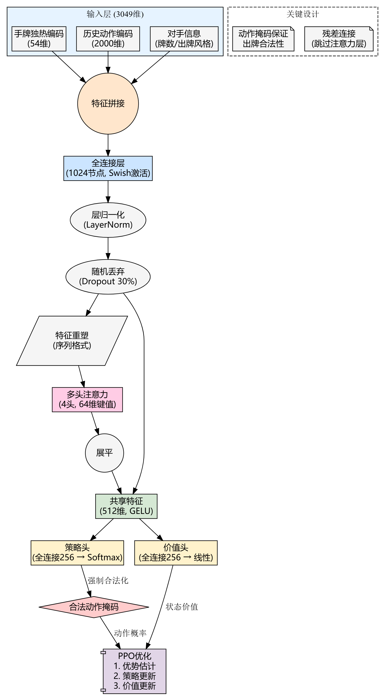

# 🎮 掼蛋强化学习 [在线试玩](https://guandan.streamlit.app/)


一个基于强化学习的掼蛋 AI 系统，支持 Actor-Critic（A2C）网络，具备训练与推理功能，使用自定义状态空间与奖励机制。

---

## 🚀 快速开始

### 1. 克隆项目

```bash
git clone https://github.com/746505972/guandan.git
cd guandan
```

### 2. 安装依赖

建议使用虚拟环境：

```bash
pip install -r requirements.txt
```

### 3. 运行训练/评估脚本

```bash
python actor.py  # 训练主循环
```

或打开 Streamlit 界面：

```bash
streamlit run app.py
```

或打开Vue前端

1.start fastapi
```bash
uvicorn server.main:app --reload --port 8000
```

2.start Vue(dev)

>in cmd
```bash
cd guandan-frontend
npm run dev
```

请在`guandan\guandan-frontend\src\utils\axios.ts`的第三行配置好url


---

## 📊 项目结构简要说明

- `actor.py`: 训练主脚本，包含 Actor/Critic 网络结构
- `app.py`: Streamlit 可视化前端
- `FrontendGame.py`: Streamlit 可视化后端
- `display.py`: 控制台可视化前后端&胜率计算
- `give_cards.py`、`rule.py`: 工具函数、规则逻辑
- `doudizhu_actions.json`: 结构化动作空间
- `setup.py`: Cython编译文件
- `model/`: 存放模型结构
- `server/`: 提供FastAPI后端

---

## 👑胜率
### 单人胜率，即1MLP与1随机机器人组队 VS 2随机机器人
| Episode | 胜率(%) | 第一手出完率(%) | 一二名(%) | 一三名(%) | 一四名(%) |
|---------|--------|---------------|----------|----------|----------|
| 400     | 52.50  | 25.50         | 39.05    | 39.05    | 21.90    |
| 600     | 46.00  | 24.50         | 42.39    | 34.78    | 22.83    |
| 800     | 60.50  | 36.00         | 36.36    | 39.67    | 23.97    |
| 1000    | 65.00  | 35.50         | 39.23    | 43.85    | 16.92    |
| 1200    | 55.00  | 31.50         | 32.73    | 45.45    | 21.82    |
| 1400    | 64.00  | 42.00         | 32.81    | 45.31    | 21.88    |
| 1600    | 63.00  | 47.50         | 35.71    | 45.24    | 19.05    |
| 1800    | 66.00  | 40.00         | 31.82    | 44.70    | 23.48    |
| 2000    | 64.00  | 46.00         | 32.81    | 46.09    | 21.09    |
| 2200    | 68.50  | 53.50         | 36.50    | 47.45    | 16.06    |
| 2400    | 58.50  | 33.50         | 37.61    | 37.61    | 24.79    |
| 2600    | 71.50  | 53.00         | 37.06    | 42.66    | 20.28    |
| 2800    | 68.00  | 50.00         | 38.97    | 41.91    | 19.12    |
| 3000    | 62.00  | 40.00         | 33.06    | 42.74    | 24.19    |

### 团队胜率，即2MLP组队 VS 2随机机器人
| Episode | 胜率(%) | 一二名(%) | 一三名(%) | 一四名(%) |
|---------|--------|----------|----------|----------|
| 400     | 52.50  | 37.14    | 40.00    | 22.86    |
| 600     | 55.50  | 27.93    | 59.46    | 12.61    |
| 800     | 61.50  | 31.71    | 47.97    | 20.33    |
| 1000    | 61.00  | 47.54    | 37.70    | 14.75    |
| 1200    | 65.50  | 48.09    | 35.88    | 16.03    |
| 1400    | 66.00  | 52.27    | 30.30    | 17.42    |
| 1600    | 73.50  | 55.78    | 27.21    | 17.01    |
| 1800    | 74.50  | 46.98    | 38.26    | 14.77    |
| 2000    | 76.50  | 49.67    | 35.95    | 14.38    |
| 2200    | 81.50  | 57.67    | 26.99    | 15.34    |
| 2400    | 70.50  | 52.48    | 31.21    | 16.31    |
| 2600    | 80.00  | 61.88    | 26.25    | 11.88    |
| 2800    | 84.00  | 64.88    | 24.40    | 10.71    |
| 3000    | 79.00  | 55.06    | 25.95    | 18.99    |



**Transformer单人及团队测试胜率折线图**

---
## 🧠 强化学习设计说明

### ✅ A2C 网络结构（2025/4/25）

- **ActorNet**：输出结构动作 `action_id` 的概率分布（考虑了合法性 mask）。
- **CriticNet**：输出当前状态的 `value` 估计。

### 🎯 奖励函数

```python
r = reward + gamma ** (len(memory) - i - 1) * final_reward
```

- `reward`：即时奖励 = 出牌长度 × 牌型的 `logic_point`
- `final_reward`：整局奖励。队伍获胜时，等级为：12名→3，13名→2，14名→1，失败则为相反。
- `memory`：记录整局信息：
```python
  memory = [{state, action_id, reward}, ...]
 ```

### 🧮 优势函数（Advantage）

$$
\text{advantage} = r + \gamma \cdot V(s') - V(s)
$$

> 最后一个 `transition` 无 `s'`，设 $\gamma \cdot V(s') = 0$

- **Actor Loss**: $-\log(p) \cdot \text{advantage}$
- **Critic Loss**: $\text{advantage}^2$


---

## 🀄 状态编码（2025/4/20）

使用 One-Hot 或多热编码，构造状态维度如下：

| 特征             | 维度            | 描述                               |
|------------------|------------------|------------------------------------|
| 当前玩家的手牌     | 108              | 两副牌的 54 张牌的是否在手信息         |
| 其他玩家手牌数量    | 3                | 剩余牌数（归一化）                     |
| 每个玩家最近动作    | 108 × 4          | 上轮每位玩家的出牌                     |
| 出过的牌          | 108 × 3          | 记录其他玩家已经打出的牌                |
| 当前级牌         | 13               | One-hot 编码                         |
| 最近 20 次动作    | 108 × 4 × 5      | 5 轮历史，每轮 4 玩家，每人 108 维       |
| 协作状态         | 3                | 与队友协作的程度                      |
| 压制状态         | 3                | 对敌方的打击程度                      |
| 辅助状态         | 3                | 是否有意铺路（辅助队友）               |
| **总维度**        | `3049`           | 完整输入维度                         |

### 🃏 示例手牌编码：

```python
hand = ['红桃2', '红桃2','黑桃3', '红桃3', '黑桃4', '红桃4', '红桃4', '黑桃4',
        '黑桃5', '红桃5','大王','小王','大王']
```

其编码如下：

```
[0. 1. 1. 1. 0. 0. 0. 0. 0. 0. 0. 0. 0. 1. 1. 1. 1. 0. 0. 0. 0. 0. 0. 0. 0. 0. 0. 0. 0. 0. 0. 0. 0. 0. 0. 0. 0. 0. 0. 0. 0. 0. 0. 0. 0. 0. 0. 0. 0. 0. 0. 0. 0. 0. 1. 0. 0. 0. 0. 0. 0. 0. 0. 0. 0. 1. 0. 1. 0. 0. 0. 0. 0. 0. 0. 0. 0. 0. 0. 0. 0. 0. 0. 0. 0. 0. 0. 0. 0. 0. 0. 0. 0. 0. 0. 0. 0. 0. 0. 0. 0. 0. 0. 0. 1. 1. 0. 1.]
```
>108维具体为{黑桃、红桃、梅花、方块}与{2、3、4、…、K、A}作积，生成52维。具体是{黑桃、红桃、梅花、方块}2、{黑桃、红桃、梅花、方块}3、…，如此再重复一遍为104维，再加上{小王、大王、小王、大王}得到最终108维。
---
## 📄 License

本项目遵循 [MIT License](https://github.com/746505972/guandan/blob/main/LICENSE)
